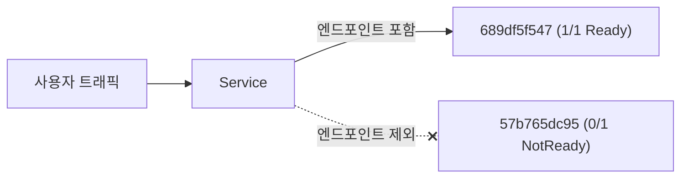
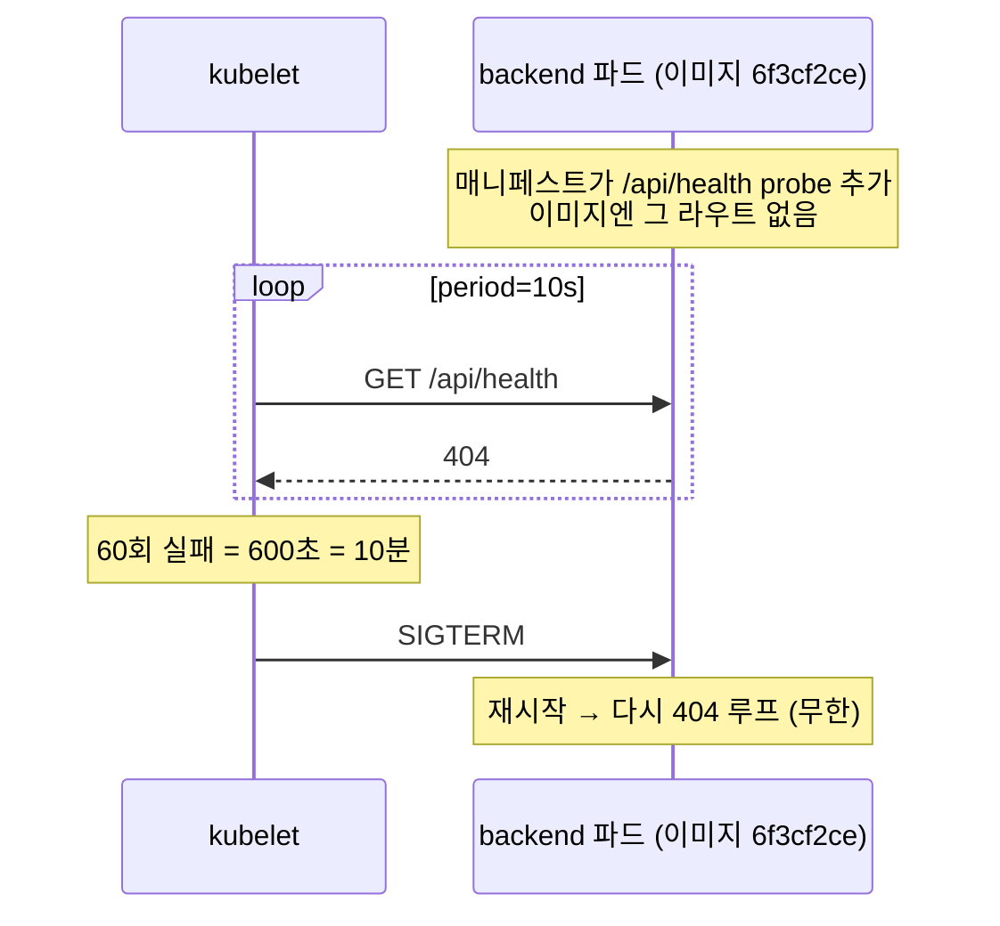

# 재시작 398회, 그런데 서비스는 멀쩡했다 — 쿠버네티스 크래시루프 완전 분석

> 운영 중인 온라인 저지 플랫폼에서 백엔드 파드가 사흘간 398번 재시작하고 있었다.
> 그런데 사용자는 아무 문제를 못 느꼈다. 이 "괜찮아 보이는 장애"를 로그 한 줄에서 근본 원인까지 파고든 기록.
> readiness probe, 릴리즈 스큐, 그리고 헬스체크가 어떻게 장애를 숨기는가에 대하여.

**환경**: Kubernetes(k3s) · Django 백엔드 · Harbor 사설 레지스트리 · kustomize 기반 수동 GitOps

---

## 0. TL;DR

- 증상: 백엔드 파드 4개가 `0/1 Running`, 재시작 398회, 2일 18시간째. 그런데 서비스는 정상.
- 원인: 매니페스트에 추가한 `/api/health` probe가, **그 엔드포인트가 아직 없는 이미지**를 때려서 계속 404 → startup probe 실패 → 10분마다 kill.
- 서비스가 멀쩡했던 이유: 크래시 파드는 NotReady라 트래픽을 못 받고, probe가 없던 **옛 리비전**이 트래픽을 다 받고 있었다.
- 교훈: readiness probe가 없는 배포는 "green"으로 위장한다. probe와 그 대상 엔드포인트는 같은 릴리즈로 묶어야 한다.

---

## 1. 발단: 눈에 걸린 숫자

파드 목록을 습관적으로 훑다가 멈췄다.

```
NAME                       READY  STATUS    RESTARTS   AGE
backend-57b765dc95-xxxxx   0/1    Running   398        2d18h
backend-57b765dc95-yyyyy   0/1    Running   397        2d18h
backend-57b765dc95-zzzzz   0/1    Running   398        2d18h
backend-57b765dc95-wwwww   0/1    Running   398        2d18h
backend-689df5f547-aaaaa   1/1    Running   0          16d
backend-689df5f547-bbbbb   1/1    Running   0          16d
```

`RESTARTS 398`. 파드 이름의 해시(`57b765dc95`)가 같은 걸 보면 같은 ReplicaSet에서 나온 형제들이다. 넷 다 `0/1`. 그런데 이상하게도 사이트는 잘 돌아가고 있었다. 사용자 문의도 없었다.

**"멀쩡해 보이는데 안 멀쩡한" 상태 — 이게 제일 무섭다.** 알람이 안 울리는 장애이기 때문이다. 롤아웃은 사실 몇 주째 멈춰 있었고, 그동안 배포한 모든 변경이 반영되지 않고 있었다.

---

## 2. 왜 서비스는 살아있었나 — Ready의 의미

파고들기 전에 이 역설부터 이해해야 한다.

쿠버네티스에서 `READY` 컬럼의 `0/1`은 "컨테이너 1개 중 Ready 상태가 0개"라는 뜻이다. 그리고 결정적으로, **Ready가 아닌 파드는 Service의 엔드포인트 목록에서 빠진다.** 트래픽이 그 파드로 라우팅되지 않는다.



마침 이전 리비전 `689df5f547` 파드 2개가 `1/1`로 살아있었고, 트래픽은 전부 걔들이 받고 있었다. 그래서 새 리비전 4개가 죽어 나가도 서비스엔 티가 안 났다. 이 사실은 나중에 "왜 두 리비전의 운명이 갈렸나"의 열쇠가 된다.

---

## 3. 진단: 로그 한 줄에서 근본 원인까지

진단엔 리듬이 있다. **결정적인 한 줄을 찾고, 그 한 줄이 가리키는 다음 계층으로 내려간다.** 추측으로 건너뛰지 않는다.

### 3-1. 로그 — 앱은 죽는 게 아니다

크래시하는 파드의 **직전에 죽은 컨테이너** 로그를 봤다. `--previous`가 핵심이다.

```bash
kubectl -n <ns> logs backend-57b765dc95-xxxxx --previous --tail=100
```

```
[INFO] Starting gunicorn 20.x
[INFO] Booting worker with pid: ...
... migrations applied, fixtures loaded ...
[INFO] Listening at: http://0.0.0.0:8080
# (10분 후)
[INFO] Handling signal: term
[INFO] Worker exiting
```

앱은 완벽하게 잘 떴다. gunicorn 기동, 마이그레이션 통과, 리스닝까지. 그러다 **정확히 10분 뒤 `SIGTERM`을 받고 exit 0**으로 얌전히 종료됐다.

여기서 두 가지가 확정된다:
1. 앱이 스스로 크래시하는 게 아니다(exit 0 + SIGTERM). **밖에서 죽이고 있다.**
2. 그 주기가 10분으로 규칙적이다.

쿠버네티스에서 컨테이너를 규칙적으로 죽이는 주체는 하나 — **kubelet의 probe**다. 다음 계층은 probe다.

### 3-2. describe — 범인은 404

```bash
kubectl -n <ns> describe pod backend-57b765dc95-xxxxx
```

```
Containers:
  backend:
    Startup:   http-get http://:8080/api/health delay=0s period=10s #success=1 #failure=60
    Liveness:  http-get http://:8080/api/health delay=0s period=10s #success=1 #failure=3
    Readiness: http-get http://:8080/api/health delay=0s period=10s #success=1 #failure=3
Events:
  Warning  Unhealthy  Startup probe failed: HTTP probe failed with statuscode: 404  (x23311 over 2d18h)
  Normal   Killing    Container backend failed startup probe, will be restarted     (x398 over 2d18h)
```

한 줄이 모든 걸 말한다: **`Startup probe failed: statuscode 404`.**

산수로 검증한다:
- startup probe: `failureThreshold=60`, `period=10s`.
- 60번 연속 실패 = 60 × 10초 = **600초 = 정확히 10분.**
- 로그의 "10분 뒤 SIGTERM"과 완벽히 일치.

실패 카운트도 맞다. 10초에 한 번 실패, 2일 18시간(≈237,600초) ÷ 10 ≈ 23,760 — describe의 `x23311`과 오차 범위 안. 재시작도 66시간 ÷ 10분 ≈ 396 — `x398`과 일치.

**추측이 아니다. 계산이 맞아떨어진다. 이 순간 원인의 절반은 확정이다.**

> 💡 startup probe를 왜 쓰나: 앱이 뜨는 데 오래 걸릴 때, liveness probe가 성급하게 죽이는 걸 막으려고 "기동 유예"를 준다. 여기선 그 startup probe가 오히려 무한 재시작의 방아쇠가 됐다. 엔드포인트가 아예 없으니 유예가 끝날 때까지 절대 통과 못 하고, 통과 못 하면 kill.

### 3-3. "그런데 왜 옛 파드는 멀쩡한가"

자연스러운 의문. 두 리비전이 다른 이미지를 쓰나?

```bash
kubectl -n <ns> get rs -o wide
```

```
NAME                 DESIRED CURRENT READY  IMAGE
backend-57b765dc95   4       4       0      harbor/.../backend:6f3cf2ce...-prod
backend-689df5f547   2       2       2      harbor/.../backend:6f3cf2ce...-prod
```

**같은 이미지다.** `6f3cf2ce...-prod`. 같은 이미지인데 하나는 죽고 하나는 산다? 그럼 차이는 이미지가 아니라 **파드 스펙**에 있다.

```bash
kubectl -n <ns> get deploy backend -o wide
# READY 4/6 ... rollout status: exceeded its progress deadline
```

`4/6`, "progress deadline 초과". 롤아웃이 멈췄다는 게 공식 확정됐다.

### 3-4. diff — probe의 유무

두 ReplicaSet의 파드 템플릿을 비교했다.

```bash
diff <(kubectl get rs backend-689df5f547 -o yaml) \
     <(kubectl get rs backend-57b765dc95 -o yaml)
```

차이는 명확했다:
- 새 리비전(`57b765dc95`): **liveness / readiness / startup probe 3종을 새로 추가.**
- 옛 리비전(`689df5f547`): **probe가 아예 없음.**

이제 2장의 역설이 풀린다. 옛 파드의 `1/1`은 건강해서가 아니었다. **readiness probe가 없으면 프로세스가 뜨자마자 Ready로 간주된다.** 아무도 건강을 확인하지 않아서 그냥 Ready였던 것이다.

> 이게 핵심 통찰이다. **헬스체크의 부재는 안전이 아니라 장애 은폐다.** 옛 리비전은 사실 헬스가 나쁠 수도 있었지만, 검사를 안 하니 알 수조차 없었다.

### 3-5. git + exec — 이미지엔 그 엔드포인트가 없다

probe가 `/api/health`를 때리는데 404가 난다 = 그 이미지에 그 라우트가 없다는 뜻일 수 있다. 배포된 이미지의 커밋에서 직접 확인했다.

```bash
git show 6f3cf2ce:backend/conf/urls/oj.py
```
```python
urlpatterns = [
    url(r"^website/?$", WebsiteConfigAPI.as_view()),
    url(r"^judge_server_heartbeat/?$", JudgeServerHeartbeatAPI.as_view()),
    url(r"^languages/?$", LanguagesAPI.as_view()),
    # health 라우트 없음!
]
```

현재 HEAD엔 있다:
```python
url(r"^health/?$", HealthCheckAPI.as_view()),   # 204 반환
```

즉 헬스 엔드포인트는 `6f3cf2ce` **이후**에 추가됐다. 배포된 이미지는 그 이전이라 `/api/health`가 없다. 컨테이너 안에서 직접 확인해 쐐기를 박았다:

```bash
kubectl exec deploy/backend -- \
  curl -s -o /dev/null -w "%{http_code}\n" http://localhost:8080/api/health
# → 404
```

끝. 원인 확정.

---

## 4. 근본 원인: 릴리즈 스큐

한 문장으로: **probe(매니페스트)를, 그 probe가 검사하는 엔드포인트를 제공하는 이미지보다 먼저 배포했다.**



시간순 재구성:
1. 매니페스트에 `/api/health` probe 3종 추가 후 배포.
2. 배포된 이미지는 `/api/health`가 없는 옛 버전(`6f3cf2ce`).
3. startup probe 404 → 60회 실패 → 10분마다 kill → 무한 재시작.
4. 새 리비전이 Ready 불가 → `maxUnavailable` 보호로 롤아웃 정지.
5. probe 없던 옛 리비전이 트래픽 계속 수용 → 서비스 유지 → **아무도 눈치 못 챔.**

---

## 5. 타임라인 요약

| 시각(상대) | 사건 |
|-----------|------|
| T-0 | probe 추가된 새 매니페스트 배포 |
| T+0 | 새 파드 기동 → `/api/health` 404 시작 |
| 매 10분 | startup 60회 실패 → SIGTERM → 재시작 |
| ~2d18h | 재시작 누적 398회, 롤아웃 여전히 정지, 서비스는 옛 리비전으로 유지 |
| 발견 | `kubectl get pods`에서 RESTARTS 398 포착 → 진단 착수 |

---

## 6. 해결

두 갈래.

### 즉시 — 롤백
probe 없던 이전 리비전으로 되돌려 크래시루프를 멈추고 롤아웃 정지를 해소.
```bash
kubectl -n <ns> rollout undo deploy/backend
```
서비스 영향 없이 출혈을 멈추는 게 1순위.

### 정공법 — 순서를 지켜 재배포
`/api/health`를 포함한 새 이미지를 **먼저** 빌드·배포하고, **그다음** probe를 켠다.
```
1) 헬스 엔드포인트 포함 이미지 빌드 & push
2) 매니페스트의 이미지 태그를 그 SHA로 갱신 → apply (probe 없이 or readiness만)
3) 헬스 200 확인 후 startup/liveness probe 추가 → apply
```
probe와 그 대상 엔드포인트는 원자적으로 묶여야 한다.

---

## 7. 다시 안 겪으려면

- **probe 대상 엔드포인트는 코드로 먼저 존재를 보장한다.** probe를 추가하는 PR과 엔드포인트를 추가하는 PR을 분리하지 말거나, 최소한 배포 순서를 강제한다.
- **readiness probe 없는 서비스를 금지한다.** "1/1이니까 건강"이라는 착각을 없애야 위장된 장애가 사라진다.
- **롤아웃 정지에 알람을 건다.** `kubectl rollout status`가 progress deadline을 넘기거나, `RESTARTS`가 임계치를 넘으면 알림. 이번 건은 알람이 없어서 사흘을 몰랐다.
- **헬스 엔드포인트는 얕게.** `/api/health`는 의존성(DB 등) 없이 프로세스 생존만 204로 답하게 해, 배포 초기에 무조건 통과하도록 설계한다(deep health check는 별도 경로로).

---

## 8. 이 사건이 가르쳐준 것

1. **"멀쩡해 보임"을 믿지 마라.** Ready는 "검사 통과"가 아니라 "검사했다면 통과"일 수 있다. readiness probe가 없으면 Ready는 거짓말을 한다.
2. **진단은 산술로 확정한다.** `failureThreshold × period = 재시작 주기`가 로그와 맞을 때 비로소 "확실하다". 정황이 아니라 계산.
3. **계층을 건너뛰지 마라.** 로그 → describe → ReplicaSet → git → exec. 각 계층이 다음 계층을 가리킨다. `--previous`, `-o wide`, `git show <sha>:<path>`, `kubectl exec ... curl` — 이 네 개가 이번 진단의 도구 전부였다.
4. **매니페스트와 이미지는 한 몸이다.** 둘의 릴리즈가 어긋나면 스큐가 나고, 스큐는 이렇게 조용히 사흘을 잡아먹는다.

가장 무서운 장애는 알람이 안 울리는 장애다. 그리고 그런 장애는 보통, 우리가 "안전장치"라고 믿고 켠 것(probe) 때문에 생긴다.
